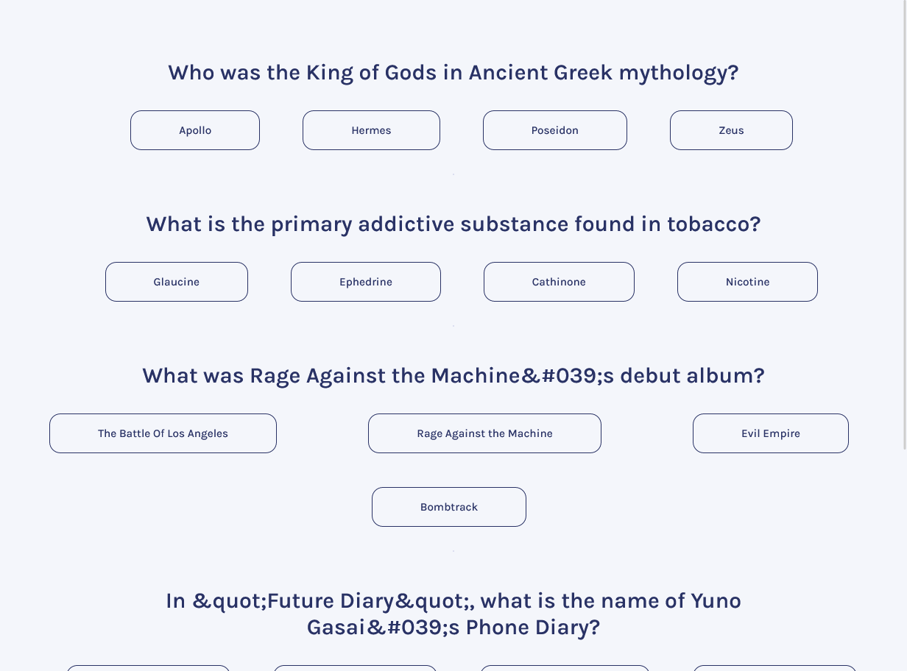

# Freecodecamp- Quzzical solution

This is a solution to the [Quzzical challenge on Freecodecamp React JS tutorial](https://www.youtube.com/watch?v=bMknfKXIFA8). 

## Table of contents

- [Overview](#overview)
  - [The challenge](#the-challenge)
  - [Screenshot](#screenshot)
  - [Links](#links)
- [My process](#my-process)
  - [Built with](#built-with)
  - [What I learned](#what-i-learned)
  - [Useful resources](#useful-resources)
- [Author](#author)

## Overview

### The challenge

Create Quiz app

### Screenshot

### Links

- Solution URL: [Solution](https://clinquant-pie-5ac909.netlify.app/)
- Live Site URL: [Live](https://github.com/Ezmad-Ze/Quizzical)

## My process

### Built with

- Semantic HTML5 markup
- CSS custom properties
- Flexbox
- CSS Grid
- [React](https://reactjs.org/) - JS library

### What I learned

I learned how to work with React JS and APIs.

### Useful resources

- [Quzzical challenge on Freecodecamp React JS tutorial](https://www.youtube.com/watch?v=bMknfKXIFA8).

## Author

- Freecodecamp - [@Ezmad-Ze](https://github.com/Ezmad-Ze)

